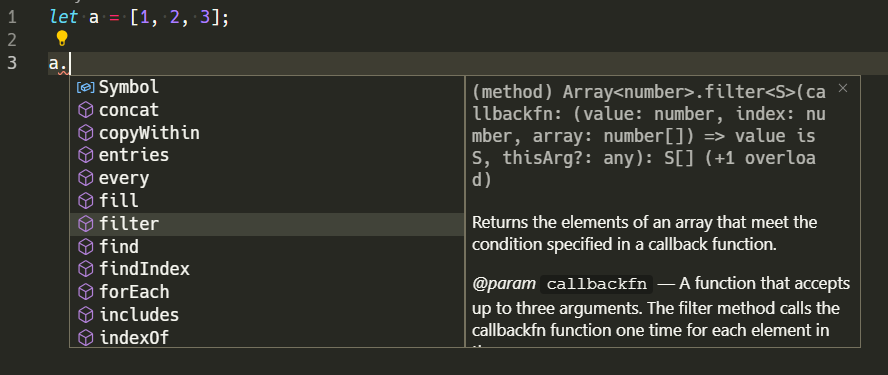
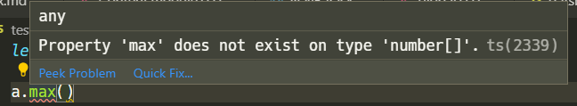
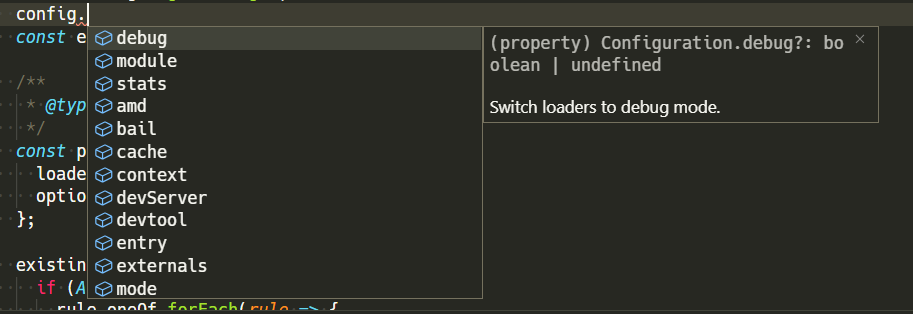

## Index

> - [Introduction](#introduction)
> - [Enable type checking](#enable-javascript-type-checking)
>     - [Type checking at project level](#type-checking-at-project-level)
>     - [Type checking at per file](#type-checking-at-per-file)
> - [Adding types](#adding-types)
>     - [Inferring types](#inferring-types)
>     - [Manually specifying types](#manually-specifying-types)
>         - [On variables](#on-variables)
>         - [On function parameters](#on-function-parameters)
>         - [Define your own type](#define-your-own-type)
>         - [Importing type definitions](#importing-type-definitions)
> - [The full list of JSDOC annotations](#the-full-list-of-jsdoc-annotations)

## Introduction

Now this post is not intended to persuade you to begin type checking your JavaScript. Rather if you're interested in type checking but *don't want to transform your code to typescript yet*, this article will inform you how to do it. 
A key benefit of this approach is that you can add type checking gradually, per file.

## Enable JavaScript type checking

> - If you are using Visual Studio Code then it will start providing autocompletion and Typescript checks in the editor as well.  
> - On other editors, you may need to configure the Typescript language server to include js files.
> - Otherwise, use the tsc cli: `tsc filename.js --allowJs --checkJs --noEmit`.

### Type checking at project level
- Create a `jsconfig.json` file at project root:

```json
{
  "compilerOptions": {
    "checkJs": true
  }
}
```

This also allows you to specify other options

```json
{
  "compilerOptions": {
    "checkJs": true,
    "noEmit": true, // Do not transpile (only type checking)
    "jsx": "react",
    "target": "es2016",
    "moduleResolution": "node",
    "lib": ["es2016", "dom"],
    "strict": true,
    "noImplicitAny": false,
    "baseUrl": "src"
  },
  "exclude": ["node_modules", "public"]
}
```

### Type checking at per file

- Add `// @ts-check` comment on top of the file you want to check

## Adding types

### Inferring types

Whenever possible, Typescript will infer the type of the variables automatically and provide relevant autocompletion and error reporting.





### Manually specifying types

> You can specify types using JSDOC comments

#### On variables

```js
/** @type {number | null} */
let a; // a will be assumed to be a number or null
```

```js
/** @type {{ prop1: string, prop2: number[] }} */
let b; // Object b will have two properties prop1 which is a string and prop2 which would be a number array
```

#### On function parameters

```js
/**
 * @param {Object} options - Object type
 * @param {string} options.prop1 - Property of Object options
 * @param {number} options.prop2 - Property of Object options
 * @param {string} arg1 - A string param.
 * @param {string} [arg2] - Optional param.
 * @param {string} [arg3="defaultValue"] - Optional param with default value
 * @return {string} return type
 */
function demo(options, arg1, arg2, arg3) {
  return arg1 + arg2 + arg3;
}
```

#### Define your own type

```js
/**
 * @typedef {Object} MyObject - Define Object type MyObject
 * @property {string} prop1 - Property of Object MyObject
 * @property {number} prop2 - Property of Object MyObject
 */
/** @type {MyObject} */
let MyObject;
```

#### Importing type definitions

> This is the really cool part. You can import type definitions form d.ts files and get type information for your npm packages.

```js
/**
 * @typedef {import('webpack').Configuration} WebpackConfig
 * @typedef {import('webpack').RuleSetRule} RuleSetRule
 * @typedef {import('webpack').RuleSetLoader} RuleSetLoader
 */

/**
 * @type {WebpackConfig}
 */
const config = getConfig(); // config has the structure of the Webpack config object!
```

##### Demo
`config` object having properties of the webpack config object.  




### The full list of JSDOC annotations

All available annotations and techniques can be read here:  
[https://www.typescriptlang.org/docs/handbook/type-checking-javascript-files.html](https://www.typescriptlang.org/docs/handbook/type-checking-javascript-files.html)
